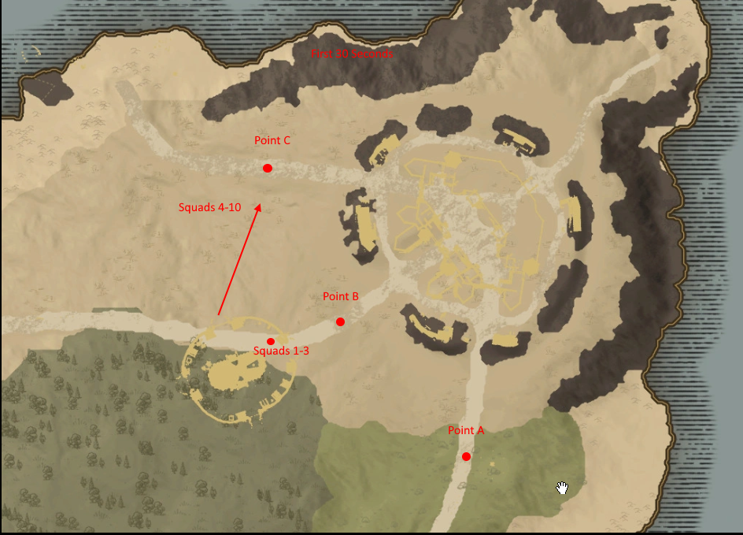
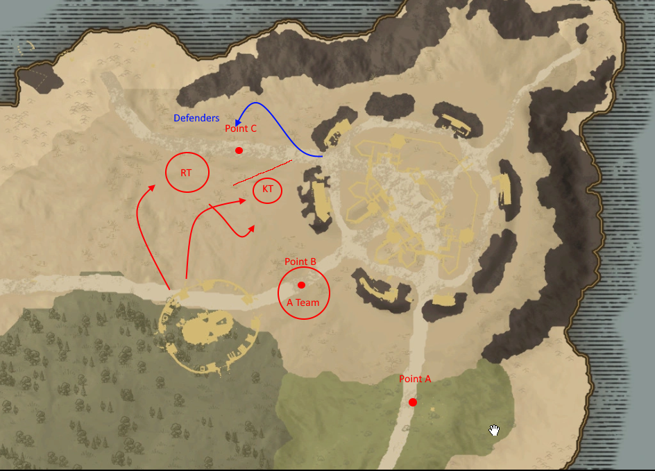

# First Light War Plan

1.  Capture point B.
1.  After capturing point B, split the defense to defend points A and C simultaneously.  
1.  Attack gates on opposite sides to split armies.
1.  Win.

## Phases
### Assignments
1.  Squads 4-10 Zerg C.  Goal is not to kill enemy, but to position the defenders badly.  
1. Squads 1-3...after 30 seconds of staying in camp wipe B and take it.  

### Summary
Zerg C with Squads 4-10.  Squads 1-3 should contain our best players.  Squads 1-3 remain in reserve for 30 seconds.   The goal of this phase is to get the defense to commit to C so that Squads 1-3 can wipe B and take it.  

---

To Start, 4-10 run to C.  The hope is to get Defense to commit and then rotate to protect B.

Here is the position goal.

In this phase, the KT (kill team) needs to stop the defense from getting to B by using gravity wells and shockwave and knock out.  RT (ranged team - Mages, Healers, Dex...) is trying to pick off healers/support from other teams.  Don't focus on the tanks.  A team (squads 1-3) kill anyone at point and dominate point.  If needed, shift RT to point for numbers.